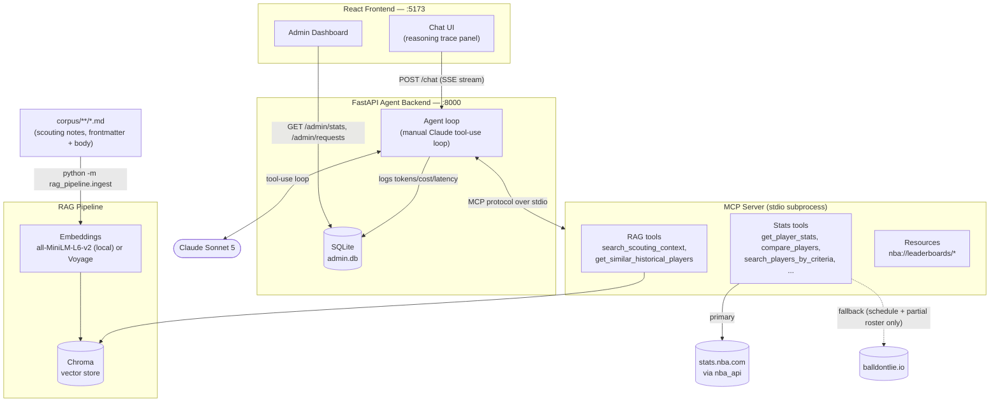

# NBA Scout Agent

An agentic NBA scouting assistant that demonstrates **MCP (Model Context Protocol) + RAG + Claude tool-use** working together: an MCP server exposes both structured stats tools and semantic-search RAG tools, and a Claude-powered agent decides — visibly, streamed live to the UI — when a question needs numbers, narrative scouting context, or both.

Built as a portfolio project to demonstrate agentic AI / MCP / RAG engineering for ML/AI engineer job applications.

## What this demonstrates

- **MCP server design** — a real `mcp` Python SDK (`FastMCP`) server exposing 8 tools + 2 resources with typed Pydantic schemas
- **Live stats data** — `nba_api` (wraps `stats.nba.com` directly) as the primary source with a `balldontlie.io` fallback for the endpoints its free tier actually supports; both verified against the real APIs, not mocked
- **Hybrid RAG** — hand-written scouting corpus, chunked and embedded (local `all-MiniLM-L6-v2` or Voyage AI), retrieved via Chroma with metadata filtering, blended with a stat-vector cosine similarity for "similar historical players" — style, not just box-score
- **Agentic tool orchestration** — a manual Claude tool-use loop (not a black-box runner) so every tool call, its arguments, and its result can be streamed to the frontend as it happens
- **Live reasoning trace** — SSE-streamed `thinking` / `tool_call` / `tool_result` / `final_answer` events, rendered in a collapsible panel that visually distinguishes structured-data calls from RAG calls
- **Eval harness** — 10 test queries (stats-only / RAG-only / hybrid) scored on tool-selection correctness, not answer quality
- **Usage tracking** — every chat request logs token counts, estimated cost, latency, and tool calls to SQLite, surfaced on a separate admin dashboard

## Architecture



## Monorepo structure

```
mcp_server/       MCP server: tool schemas, stats + RAG tool implementations, resources
rag_pipeline/     Corpus ingestion: frontmatter parsing, chunking, embeddings, Chroma
agent_backend/    FastAPI app: Claude tool-use loop, SSE streaming, usage logging, eval harness
frontend/         React + TypeScript + Vite: chat UI + admin dashboard
corpus/           Sample scouting write-ups (markdown, see format spec below)
```

## Setup

### 1. Python backend (MCP server, RAG pipeline, agent backend)

Requires Python 3.11+ and [`uv`](https://docs.astral.sh/uv/).

```bash
uv venv --python 3.11
uv sync
```

(`requirements.txt` is also provided — generated from `pyproject.toml`/`uv.lock` via `uv export`, kept in sync rather than hand-maintained — for `pip install -r requirements.txt` workflows that don't use `uv`.)

Copy `.env.example` to `.env` and fill in:

```bash
cp .env.example .env
```

| Variable | Required | Notes |
|---|---|---|
| `ANTHROPIC_API_KEY` | Yes | Agent backend won't start without it |
| `EMBEDDING_PROVIDER` | No (default `local`) | `local` = `all-MiniLM-L6-v2` via Chroma's bundled ONNX runtime, no key/rate limits. `voyage` = higher quality, needs `VOYAGE_API_KEY`, subject to Voyage's rate limits |
| `VOYAGE_API_KEY` | Only if `EMBEDDING_PROVIDER=voyage` | |
| `BALLDONTLIE_API_KEY` | Recommended | Free-tier key from [balldontlie.io](https://www.balldontlie.io) — used as a fallback when `stats.nba.com` is unreachable. Free tier only covers `/players`, `/teams`, and `/games` (schedule); it does **not** include `/stats` or `/season_averages` (401 on those even with a valid key), so there's no fallback for `get_player_stats`/`get_player_game_log`/`compare_players` if nba_api is down — see Known Limitations |
| `MCP_SERVER_COMMAND` / `MCP_SERVER_ARGS` | No | Leave blank. The agent backend defaults to spawning `sys.executable -m mcp_server.server` (this venv's own Python) — a bare `"python"` here resolves via `PATH` and can silently pick a different interpreter on machines with multiple Python installs |

### 2. Ingest the scouting corpus

```bash
.venv/Scripts/python.exe -m rag_pipeline.ingest      # Windows
.venv/bin/python -m rag_pipeline.ingest               # macOS/Linux
```

Re-run any time `corpus/` changes — it's idempotent (drops and recreates the Chroma collection each run).

### 3. Run the agent backend

```bash
.venv/Scripts/python.exe -m uvicorn agent_backend.main:app --port 8000
```

This spawns the MCP server itself as a stdio subprocess on startup — you don't run `mcp_server` separately. Verify with `curl http://localhost:8000/health`.

### 4. Frontend

Requires Node.js 18+.

```bash
cd frontend
npm install
npm run dev
```

Opens at `http://localhost:5173`. The chat UI is at `/`, the admin dashboard at `/admin`.

### 5. (Optional) Run the eval harness

```bash
.venv/Scripts/python.exe -m agent_backend.eval.run_eval
```

Runs 10 fixed queries against the live agent and scores tool-selection correctness per query and by category (stats / RAG / hybrid). Hits the real Claude API — costs a small amount per run.

## Corpus format spec

Each file under `corpus/**/*.md` is flat-key frontmatter + a markdown body:

```markdown
---
title: Player Name — Scouting Profile
doc_type: player_profile        # player_profile | player_style_profile | team_scheme_notes | scheme_notes
player: Player Name             # optional
team: TEAM_ABBR                 # optional
era: 2001-2004 Team              # optional, historical style profiles only
historical: true                 # optional — marks a doc as a historical-comp candidate
date: 2024-11-15
author: your-name
---

Body markdown. Chunked into ~300-500 token windows (paragraph-aligned,
45-word overlap) and embedded — write in standalone paragraphs rather
than one giant block, since each chunk is retrieved independently.
```

`ingest.py` doesn't require any particular field — missing frontmatter just means empty metadata — but `player` / `team` / `doc_type` / `historical` are what the RAG tools filter on, so set them when they apply.

## Example queries

The four query types the corpus and demo queries are tuned for:

1. **Hybrid — build + compare**: "Build me a scouting report on Anthony Edwards comparing him to similar historical players"
2. **Stats-only — filter/search**: "Find undervalued 3-and-D wings under age 25 this season"
3. **Hybrid — explain a stat change**: "Why has Anthony Edwards' efficiency dropped compared to last season?"
4. **RAG-heavy — scheme narrative**: "How does Minnesota perform against switch-heavy defenses?"

## Known limitations

Being upfront about what's real vs. illustrative in this build:

- **Stats tools (`mcp_server/tools/stats_tools.py`) are stubbed.** They return realistic, schema-correct fixture data (real player IDs, real headshot URLs) but not live `nba_api`/`balldontlie.io` data — every call to `get_player_stats("Anthony Edwards")` returns the same fixed numbers regardless of season. Each function has a `# TODO(real-data)` comment describing exactly what real API call replaces it. The RAG tools and the agent's tool-selection logic are fully real.
- **`get_similar_historical_players`'s stat-similarity half** uses a small hardcoded table of ~4 historical players' stat lines, not a real historical-stats index — see `rag_pipeline/historical_stats.py`.
- **Sample corpus is illustrative**, not licensed scouting content — 7 short markdown docs written to make the four demo queries retrieve something relevant. Swap in real write-ups and re-run `rag_pipeline.ingest`.
- **No auth** on the app or the `/admin` endpoints, by design for a local demo — gate before deploying anywhere shared.
